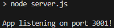

# E-Commerce Backend
## Description

This project is an Insomnia-based program. It allows the user to use the Insomnia client to create, delete, update, and retrieve data within an E-Commerce database. The database is accessed using a MySQL server.

## Installation
Download the repository on your machine, input your MySQL credentials in the .env file, then run "npm start" in an integrated terminal.

## Usage
When "npm start" is executed, the program will launch and listen to port 3001. In the Insomnia client, use the URL http://localhost:3001/api/, then suffix the URL with either categories/, products/, or tags/ to retrieve relevant data. The user can then further suffix the URL with an ID to retrieve relevant data related to that specific ID. 

Note: Using POST or PUT requires these JSON syntaxes:
Products Example
{
    product_name: "Example Product",
    price: 1776.00,
    stock: 90,
    tagIds: [1, 2, 3, 4], tag IDs here must exist 
}

Categories Example
{
	"category_name": "Example Category"
}

Tags Example
{
	"tag_name": "Example Tag"
}

## Screencap
Below is what the user will initially see in the terminal upon starting the program. Further use requires the Insomnia client.

